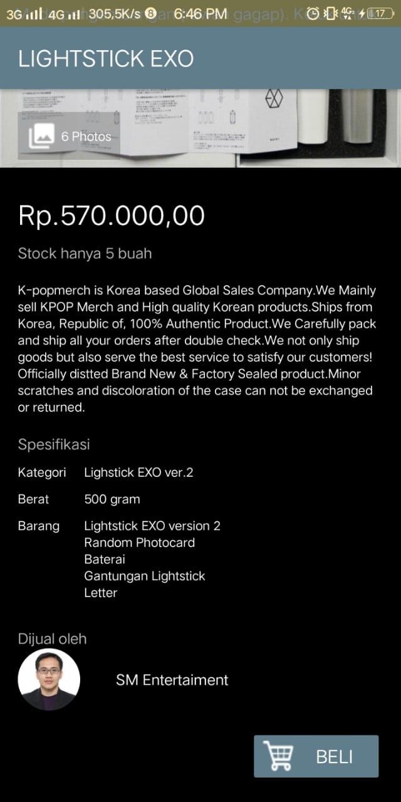

<h1>Style And Theme</h1>
<h5>* Sebuah Style adalah kumpulan properti yang menetapkan penampilan dan format untuk View. 
Style bisa menetapkan properti seperti tinggi, pengisi, warna font, ukuran font, warna latar belakang, 
dan banyak lagi yang lainnya. Gaya didefinisikan di Style.xml(Res--> Values -->style.xml) yang terpisah dari XML yang menetapkan layout.</h5>

<h5>* Sebuah tema adalah style yang diterapkan pada keseluruhan Activity atau aplikasi, bukannya View individual (seperti dalam contoh di atas).</h5>

